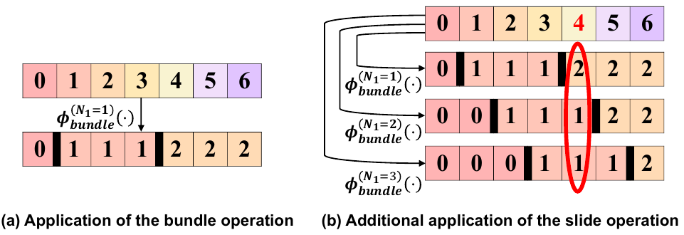

# HRDiT: Training-Free High-Resolution Image Generation with Off-the-Shelf Diffusion Transformer Models

[](https://eccv.ecva.net/virtual/2026/poster/4252)
[](https://arxiv.org/abs/2608.07003)
[](https://huggingface.co/papers/2608.07003)
[](https://zylwithxy.github.io/HRDiT-page/)

Official implementation of **HRDiT**. Our project page is at
[zylwithxy.github.io/HRDiT-page](https://zylwithxy.github.io/HRDiT-page/).

<p align="center">
  
  <br>
  <em>SPA: the bundle and slide operations (T = 7, N = 3).</em>
</p>

## 🔔 News

- **[2026-08-06]** 🎉 Initial release of the HRDiT code.
- **[2026-08-16]** ⚙️ SPA and HAP are available as ComfyUI nodes in
  [wildminder/ComfyUI-DyPE](https://github.com/wildminder/ComfyUI-DyPE):
  [SPA](https://comfy.icu/node/SPA), [HAP](https://comfy.icu/node/HAP) and
  [HAP Calibrate](https://comfy.icu/node/HAPCalibrate), thanks for their work!
- **[2026-08-27]** 🤗 The Remyx AI team has reimplemented HRDiT as a diffusers
  pipeline at
  [remyxai/hrdit-flux-modular](https://huggingface.co/remyxai/hrdit-flux-modular),
  thanks for their work!
- **[2026-08-28]** 📺 The five-minute ECCV presentation is on
  [YouTube](https://www.youtube.com/watch?v=sW20BTHyXgE).
- **[2026-08-31]** 🌐 The [project page](https://zylwithxy.github.io/HRDiT-page/)
  is live, with 4K samples and FLUX.1-dev comparisons.

## Overview

Training-free text-to-high-resolution image generation has recently attracted
growing research attention. However, existing studies on this task primarily
focus on adapting off-the-shelf U-Net-based diffusion models to high
resolutions, with limited progress on adapting off-the-shelf Diffusion
Transformer (DiT) models despite their strong text-to-image generation
capabilities at limited resolutions. In this work, we find two key challenges
particularly hindering the application of off-the-shelf DiT models for
high-resolution image synthesis in a training-free manner, namely **spatial
disorder** and **long generation time**. To address these challenges, we propose
a novel method tailored to adapt off-the-shelf DiT models for high-resolution
image synthesis, consisting of two components:

- **SPA (Spatial Position Alignment)** addresses *spatial disorder* by replacing
  each token index with a bundle index before it enters the positional encoding,
  and averaging over a set of bundle mappings whose boundaries slide, so that
  positional distinctions are restored without any training.
- **HAP (Head-adaptive Attention Pruning)** addresses *long generation time* by
  giving every attention head its own attention scope, derived once from the
  off-the-shelf model, and pruning the attention computations outside it.

HRDiT is training-free: it runs on off-the-shelf FLUX.1-dev weights and needs no
fine-tuning.

## 🔧 Installation

Tested with CUDA 12.6 on NVIDIA GPUs. HAP is built on PyTorch FlexAttention and
needs PyTorch 2.7 or newer.

```bash
conda create -n hrdit python=3.10 -y
conda activate hrdit

pip install torch==2.7.0 torchvision --index-url https://download.pytorch.org/whl/cu126
pip install -r requirements.txt
```

Download the off-the-shelf base model:

```bash
huggingface-cli download black-forest-labs/FLUX.1-dev --local-dir ./pretrained_models/FLUX.1-dev
```

## 🚀 Inference

Generate a 4K (4096x4096) image from a text prompt:

```bash
python inference.py \
    --prompt "A textbook shows a large group of people." \
    --model_path ./pretrained_models/FLUX.1-dev \
    --output_dir ./outputs
```

The image is produced progressively at 1024 -> 2048 -> 4096. The final 4K image
is written to `--output_dir`, and the 2048 intermediate to `<output_dir>_res2k/`.

To generate 2K only:

```bash
python inference.py --prompt "..." --resolutions 2048
```

To run several prompts from a file (one prompt per line, or a JSON list of
strings):

```bash
python inference.py --prompt_file prompts.txt --num_prompts 10
```

### Higher image quality

HAP only shortens generation; SPA is what restores spatial structure. Setting
`scope_plan=None` in the `pipe(...)` call of `inference.py` turns HAP off at
every step while SPA still runs: attention stays dense, generation takes
longer, and image quality is better.

### Hardware

Generation runs on a single GPU; the pipeline does not shard the model across
devices. A 4096x4096 image peaks at about 46 GiB, of which 33 GiB is the
FLUX.1-dev weights in fp16. On a 48 GB A6000 card, run with

```bash
PYTORCH_CUDA_ALLOC_CONF=expandable_segments:True python inference.py ...
```

so the allocator does not fragment. `--resolutions 2048` peaks at about 36 GiB.

### Key arguments

| argument | default | meaning |
|---|---|---|
| `--resolutions` | `2048 4096` | target resolutions, generated in order |
| `--scope_plan` | `configs/scope_plan_flux.json` | per-head attention scopes used by HAP |
| `--spa_steps` | `3 0` | number of leading denoising steps using SPA, per resolution stage |
| `--group_num` | `80` | SPA bundle granularity |
| `--global_anchor` | `32` | HAP keeps every N-th token block globally visible |
| `--seed` | `3407` | random seed |
| `--dtype` | `fp16` | `fp16` or `bf16` |

## Deriving a scope plan

`configs/scope_plan_flux.json` holds the per-head attention scopes HAP prunes
with, and is ready to use as shipped.

To derive a plan for a different attention budget, see
[HRDiT-HAP](https://github.com/zylwithxy/HRDiT-HAP), which contains the
profiling and plan-search pipeline. Its output drops straight into
`--scope_plan`.

## Citation

```bibtex
@inproceedings{xue2026hrdit,
  title={{HRDiT}: Training-Free High-Resolution Image Generation with Off-the-Shelf Diffusion Transformer Models},
  author={Xue, Yu and Qu, Haoxuan and Li, Zhuoling and Xu, Hongbin and Yin, Jianxiong and See, Simon and Rahmani, Hossein and Liu, Jun},
  booktitle={European Conference on Computer Vision (ECCV)},
  year={2026}
}
```

## Acknowledgements

The code is built upon [HiFlow](https://github.com/Bujiazi/HiFlow),
[FLUX](https://github.com/black-forest-labs/flux) and
[I-Max](https://github.com/PRIS-CV/I-Max), thanks for their work!
